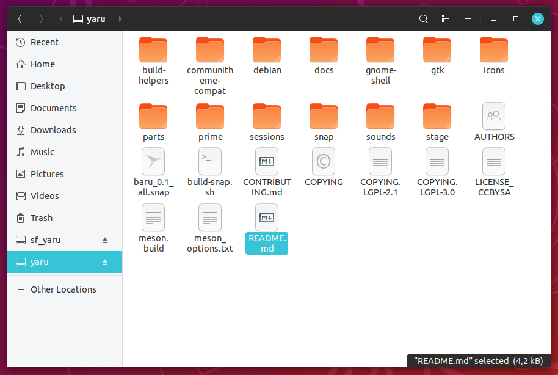

# Baru Ubuntu theme

This is a variant of the [Yaru](https://github.com/ubuntu/yaru) Ubuntu theme.

<p align="center">
   
</p>

## Installing

1. Install the [User Themes](https://extensions.gnome.org/extension/19/user-themes/) extension.
2. Grab the `themes.tar.gz` from the latest release and extract it to `~/.themes`.
3. Grab the `icons.tar.gz` from the latest release and extract it to `~/.icons`.
4. Open GNOME Tweak and set the appearance of applications, cursor, icons and shell to "Baru".
5. Restart GNOME shell.

If you use Ubuntu's dash to dock run:
```bash
gsettings set org.gnome.shell.extensions.dash-to-dock custom-theme-running-dots-color '#37c4d6'
gsettings set org.gnome.shell.extensions.dash-to-dock custom-theme-running-dots-border-color '#37c4d6'
```

## Building

1. Create the build Docker container with: `docker build -t mzur/baru .`
2. Run the build: `docker run --rm --user=$UID -v $(pwd):/build mzur/baru ./build.sh`
3. You get the `icons.tar.gz` and `themes.tar.gz` release files.
